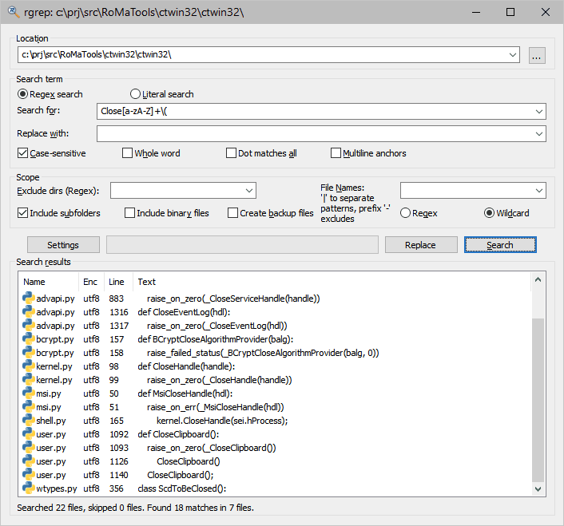

# rgrep

-----

rgrep is a GUI [grep](https://en.wikipedia.org/wiki/Grep) tool for Windows.
It is based on [PCRE2](https://www.pcre.org) (see [PCRE2 license
](https://github.com/RoccoMatano/rgrep/blob/master/src/pcre2_16/LICENCE)).
I wrote it because I wanted something similar to
[grepWin](https://github.com/stefankueng/grepWin), just a little different.

This is how it looks like:

